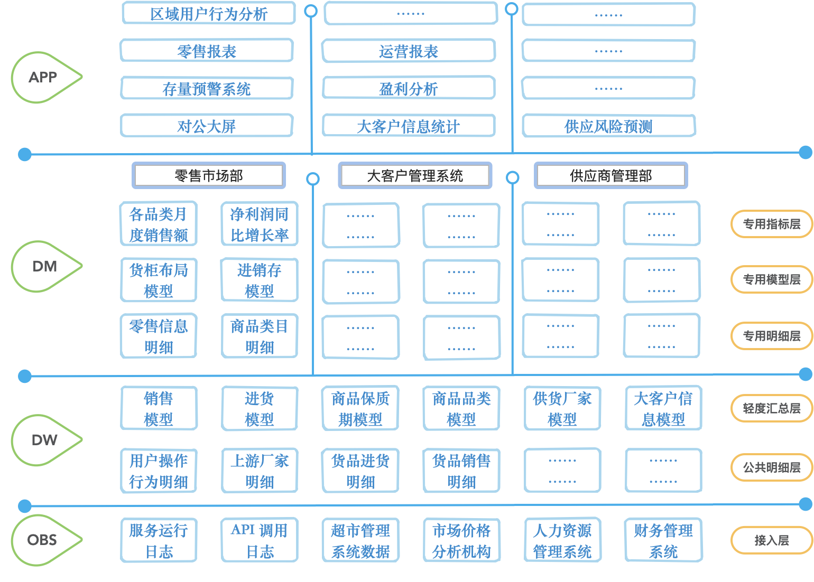

上文[《报表自动化: 商业智能背后的秘密》](https://www.coologic.cn/2020/02/1746/)主要讲了我认为的如何逐步做到商业智能，通过**报表自动化、数据图表化、数据可视化、数据挖掘四步走**的方式，逐步的让数据产生价值。

我们主要讲报表自动化，但在这之前我们需要有“**大量的数据**”支持，多次提到“大量的数据”，这些数据就是指我们各种产品在使用、运行过程中存到数据库的数据，当然也包括日志中的数据，这些数据在我们产品运行过程中生成且同时为产品运行提供服务，如果是数据库中的数据，那么还可能出现数据分别存储在各种库、表、文件中，他们已最初业务功能的需要进行着“合理”或者早已被多人“吐糟”的方式分布着。

那么,我们报表自动化的实践就是先要让一个服务连接上所有的产品数据库，然后构建出所有表的 entity 用我们熟悉的 JAVA、PHP 等语言完成么？实际上并不是这样的，在这之前，我们首先要先建立“数据仓库”。

那数据仓库是什么？他是如何设计的？

# 数据仓库的设计

数据仓库的设计方式有很多种，这里主要讲一种设计方式 DB-ODS-DW-DM 分层设计，这里引入了四个单词，由他们构成的数据流如下

图中箭头表示数据的流向，可以看到我们的数据大致是这样流动的：

- **五湖四海**：无论是数据库里的、日志里的、第三方服务、数据提供方的等等，最初的数据便不再五湖四海
- **海纳百川**：来自五湖四海的数据汇聚于一点，OBS 承担着至关重要的一步 -- **收集**
- **类聚群分**：杂乱无章的堆积终究不便于使用，无论怎样开门看到了混乱的现场要先收拾一下，分门别类的 -- **整理**
- **术业专攻**：庞大的仓库涵盖了太多的信息，就算我们整理好了也没有能力自我消化，需要找到专人专才去处理对应的信息，进行加工 -- **分析**
- **天道酬勤**：经过复杂的收集、整理、分析后，我们终于让东西产生了价值，可以开始对外输出了

# DB(Data Bases)

这里实际上是指我们的产品 / 业务系统的数据层，这里要用层的概念了，他们可能由多个库构成，这个数据层提供了业务正常运行的支持，如果要做数据仓库，DB 数据层还需要提供，在一定时间里被 ETL 工具批量拉取数据到 ODS 的支持。

注意这里数据拷贝不是人工拷贝，需要使用 ETL（Extract-Transform-Load）工具，ETL 指数据的抽取、转换、加载，可以通过 ETL 工具配置数据从源到目标的操作行为并定时触发，这个后文有所介绍。

# OBS(Operational Data Store)

ODS(Operational Data Store)，操作性数据，是作为数据库 DB 到数据仓库 DW 的一个过渡层 / 中间层。

实际上在做报表自动化时并不是直接从产品库获取数据的，是需要先构建数据仓库的，而数据仓库的第一步就是先将所有的产品库的各种数据都 copy 到一个“中间层 OBS”，后续所有的数据仓库都通过“中间层 OBS”获取数据，这样的操作有如下好处：

-  **隔离性**：将业务系统和数据仓库隔离
- **冗余**：这是数据的第一次冗余，当然也可以说是一次备份，通过一个超大的数据库涵盖所有的业务数据
- **汇聚**：直接打破业务壁垒，将所有数据汇聚在一起，有利于后续数据梳理时的思考，可以让自己发挥各种想象
- **降低业务系统压力**：这也是冗余的另一个目的，无论是报表自动化还是数据挖掘，都可能产生对数据库的大量操作，将业务与数据分析分离，让两者性能上不受影响，业务数据库只需要提供一次性的读取支持即可

这一层是个大一统层，它的主要作用是将多个源库内容全部同步到本库中，ETL 工具会四处拉取数据到这里，考虑到单一职责原则，这一层数据结构一般就不会改变了，往往和源库的各个表的结构保持一致。

同样的这一层既然是为了汇总数据，那么数据的写入只能由 ETL 工具进行，这时候就遇到了源数据库的内容发生了变化怎么办？每次拷贝来的数据有重复如何处理？

- 如果需要**保留每一次拷贝的样本**，那么可以考虑对每个表增加一个时间字段，来标记每次拷贝的内容，通过这个字段的区分可以解决上述两个问题。

- 如果**资源有限**，且对于**历史变动并不在乎**，只需要当前状态，那么可以考虑每次拷贝数居前先删除 OBS 表内信息，再拉取
- 如果**资源有限**，且**数据量很大**很大，又希望**快速的拷贝**，那么可以考虑现在源数据处增加一些获取条件，将不变的数据过滤掉，比如如果每天更新一次，那么只需要获取 created time 或者 updated time 是今天的内容，然后 upsert 到 OBS 对应表

# DW(Data Warehouse)

> 这里讲的是数据仓库的数据仓库层。。。。

数据仓库，说到了仓库我们可以想象一下现实中的各种仓库的样子，其实数据仓库也是类似的。

前面 ODS 无条件的接受了所有的信息，也许他唯一能做的就是通过合理的 table 命名来识别出来每个表是从哪个产品库来的数据了，简直是一个超级大的混乱空间，而仓库主要做的就是“规整”。

数据仓库的建模（“整理”）方法有多种，**范式建模法**（Third Normal Form，3NF）、**维度建模法**（Dimensional Modeling）、**实体建模法**（Entity Modeling）……

通过各种方式的整理最终的目标是：

- **可读性**：混乱的东西永远无法知道他们是什么，整理以后可以清晰地理解他们之间的关系。比如维度建模法构建成了事实表和维度表，每一个事实表都是业务主要数据的记录，其内包含多种事实数据与维度表 id，通过维度表 id 可以进一步的获得更多的详细信息，比如时间系列的日期、年月日、星期几，再比如类型系列的类型中文名、详细描述信息等等。维度建模的具体情况后文详细介绍。
- **分类清晰**：分分合合，经过 OBS 层将所有数据揉到一起以后，到了 DW 层我们有了一个全新的机会去根据数据之间的关系进行 link，构成一个一个有价值的数据域，当然这个划分很可能只是通过表名来区分，可能并不会进行分库。
- **打破业务壁垒**：这里的分类主要还是从数据角度出发，可以打破业务已有的壁垒。
- **高质量**：对数据重新整理一次，将有用的保留，完全无效已经抛弃的字段可以扔掉。同时高质量也是我们在构建数据仓库要保证的，我们可以在这一阶段删掉完全无用的字段，但更重要的是详细的确认有效的信息是否正确、全面。
- **高效率**：经过清晰地分类，重新根据数据间关系分类组合，并严谨的对待每一条数据，我们具有了一个高质量、清晰可读、分类明确的数据仓库，这样我们就可以更快速的找到我们想要的东西了

注意数据仓库只是仓库，存储了各种东西，它很整洁，但是它并没有完全的挖掘出存在其内数据的价值，挖掘的步骤就需要下一层了。

# DM(Data Mart)

数据集市(Data Mart) ，也叫数据市场，数据集市就是满足特定的部门或者用户的需求，按照多维的方式进行存储，包括定义维度、需要计算的指标、维度的层次等，生成面向决策分析需求的数据立方体。

首先解释一下前面的图里为什么有那么多的 DM 数据库：DM 实际上可以根据业务、部门进行分割了，不同部门 / 业务 / 产品，可以由自己独有的数据库。

其次说说这里面装的是什么：

DM 库里往往会装一些能直接对外输出的内容，比如最终可以快速的为报表提供查询服务的数据，还比如各种各样的指标。

那什么是指标？同比增长率、月度销售总额、转换率、平均利润率、日点击总数……具体的后面进行更详细介绍

实际上数据仓库不只是简单地几层，比如上图我“大概”、描述（“假想”）了一个数据仓库的更复杂一些的模型。

分层的目的，无外乎还是希望各司其职，收集、整理、分析，我们的输入就是各个数据源拉过来的信息，经过 OBS 的囫囵吞枣、DW 建模归纳，最终我们的 DM 层直接对外提供更有价值数据。

本文简单的介绍了一种数据仓库的分层设计，主要提及了 OBS 层、DW 层、DM 层，这里过多的说了概念，后面开始抛出细节。比如后面让我们来聊聊 DW 层建模方法之维度建模。

